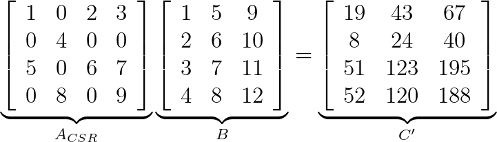

# cuSPARSE Generic APIs - `cusparseSpMM CSR`

## Description

This sample demonstrates the usage of `cusparseSpMM` for performing *sparse matrix - dense matrix multiplication*, where the sparse matrix is represented in CSR (Compressed Sparse Row) storage format.

[cusparseSpMM Documentation](https://docs.nvidia.com/cuda/cusparse/index.html#cusparse-generic-function-spmm)

<center>

`C = alpha * A * B + beta * C`


</center>

## Building

* Linux
    ```bash
    make
    ```

* Windows/Linux
    ```bash
    mkdir build
    cd build
    cmake ..
    make
    ```
    On Windows, instead of running the last build step, open the Visual Studio Solution that was created and build.

## Support

* **Supported SM Architectures:** SM 3.5, SM 3.7, SM 5.0, SM 5.2, SM 5.3, SM 6.0, SM 6.1, SM 6.2, SM 7.0, SM 7.2, SM 7.5, SM 8.0, SM 8.6
* **Supported OSes:** Linux, Windows, QNX, Android
* **Supported CPU Architectures**: x86_64, ppc64le, arm64
* **Supported Compilers**: gcc, clang, Intel icc, IBM xlc, Microsoft msvc, Nvidia HPC SDK nvc
* **Language**: `C99`

## Prerequisites

* [CUDA 11.0 toolkit](https://developer.nvidia.com/cuda-downloads) (or above) and compatible driver (see [CUDA Driver Release Notes](https://docs.nvidia.com/cuda/cuda-toolkit-release-notes/index.html#cuda-major-component-versions)).
* [CMake 3.9](https://cmake.org/download/) or above on Windows

## CUDA Math Library Synchronization Behavior
Running the code with `--test_API_on_stream` enabled and disable the computation logic, we obtain the folloing output, suggesting the cusparse environment and data handle creation APIs are blocking on the host side.

```
❯ ./bench_spmm_csr_partitioned --A_num_rows=128 --A_num_cols=256 --B_num_cols=256 --AA_num_rows=16 --AA_num_cols=64 --BB_num_cols=64 --A_sparsity=0.1 --test_API_on_stream
This is to test if cusparse environment and matrix handle creation APIs are on any stream or not. There are three possibilities 1) the API is blocking, 2) the API is on default stream, and 3) the API is on the specified stream set by cusparseSetStream. We can use two events to check if either 2) or 3) is true. We use C++ chrono to check if 1) is true.
A_num_rows: 128
A_num_cols: 256
B_num_cols: 256
AA_num_rows: 16
AA_num_cols: 64
BB_num_cols: 64
A_sparsity: 0.100000
actual A_nnz due to deduplication during random data generation: 3114
[DEBUG] cusparseSpMM+CSR handle creation chrono time (microseconds): 212168
[DEBUG] cusparseSpMM+CSR data handle and buffer creation chrono time (microseconds): 340
cusparseSpMM+CSR+Partitioned [DEBUG]API_0_data_handle_and_buffer_creation elapsed time(util) (ms): 0.300800
cusparseSpMM+CSR+Partitioned [DEBUG]API_0_handle_creation elapsed time(util) (ms): 212.165634
cusparseSpMM+CSR+Partitioned [DEBUG]API_stream_data_handle_and_buffer_creation elapsed time(util) (ms): 0.301056
cusparseSpMM+CSR+Partitioned [DEBUG]API_stream_handle_creation elapsed time(util) (ms): 212.16464
```